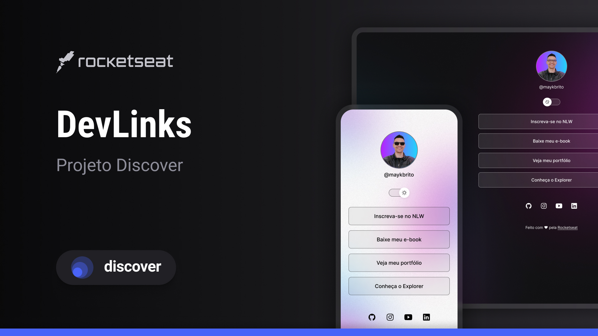

# 🚀 Projeto Discovery

O **DevLinks** é um agregador de links que funciona como um **cartão de visitas online**, permitindo reunir em um único lugar links para redes sociais, portfólio e outros conteúdos.

Este projeto foi desenvolvido durante um **curso gratuito da Rocketseat**, com o objetivo de praticar os fundamentos de **HTML, CSS e JavaScript**, além de conceitos de responsividade e manipulação do DOM.

---

## 📸 Preview

---

## 🔗 Projeto online

[Acessar o projeto](https://thiagofernandes46.github.io/Projeto-Discovery/)

---

## 🎨 Layout

Você pode visualizar o layout original do projeto no Figma:

🔗 [Acessar layout no Figma](https://www.figma.com/design/en4jkbj1dWuoq4ZsSU7EuR/DevLinks-%E2%80%A2-Projeto-Discover--Community-?node-id=10-620&p=f&t=C95NOCktfWKwfRgm-0)

É necessário ter uma conta no [Figma](https://www.figma.com) para acessá-lo.

---

## 🛠 Tecnologias utilizadas

- HTML5
- CSS3
- JavaScript
- Git e GitHub
- Figma

---

## ✨ Funcionalidades

- Alternância entre tema claro e escuro
- Layout responsivo
- Links para redes sociais
- Background adaptado para mobile e desktop

---

## 🚀 Aprendizados

Durante o desenvolvimento deste projeto, foram praticados:

- Estruturação de páginas com HTML
- Estilização com CSS
- Responsividade com media queries
- Manipulação de classes com JavaScript
- Versionamento com Git e GitHub

---

## 📄 Licença

Este projeto está sob a licença MIT.

---

## 👨‍💻 Autor

Thiago Fernandes  
Designer | Desenvolvedor Front-End em formação
